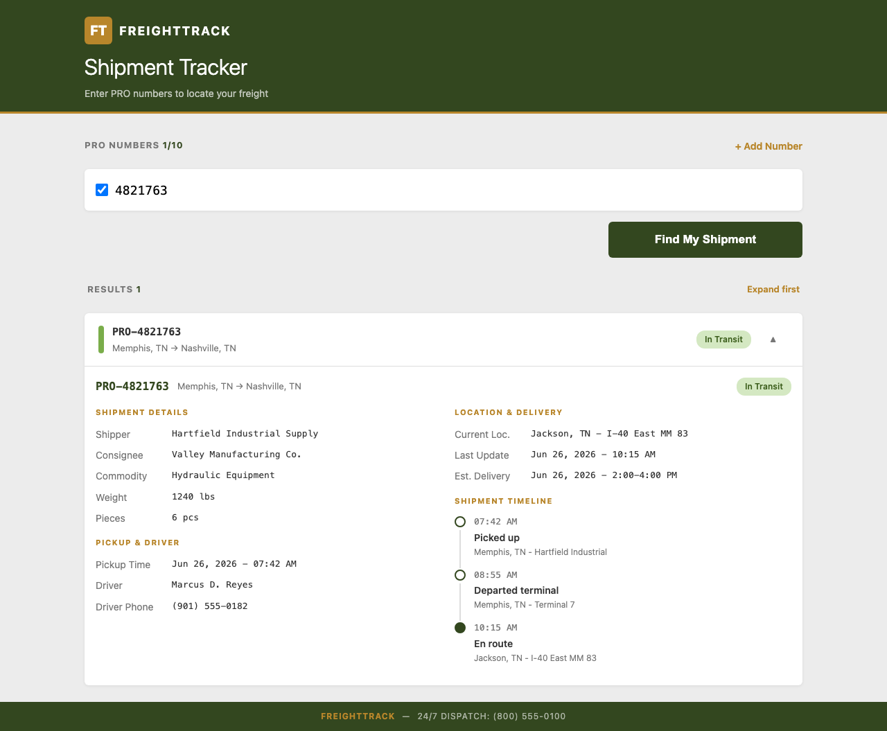
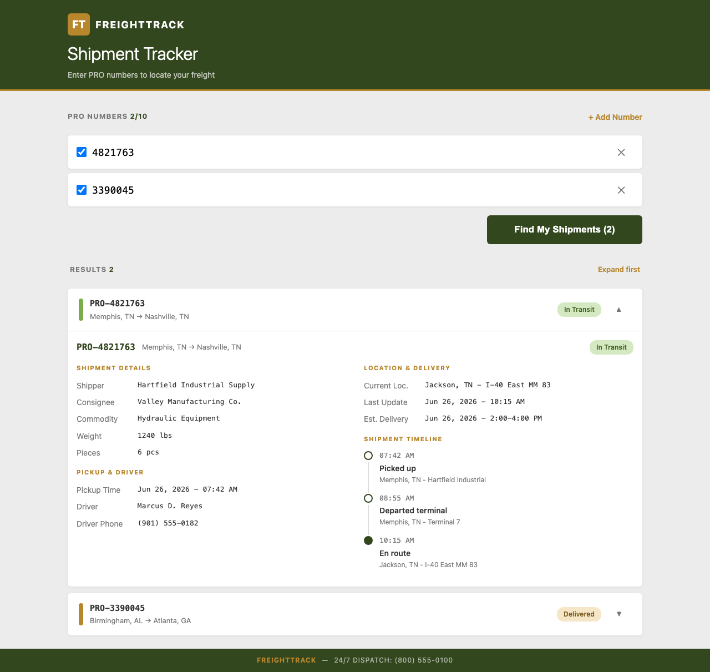
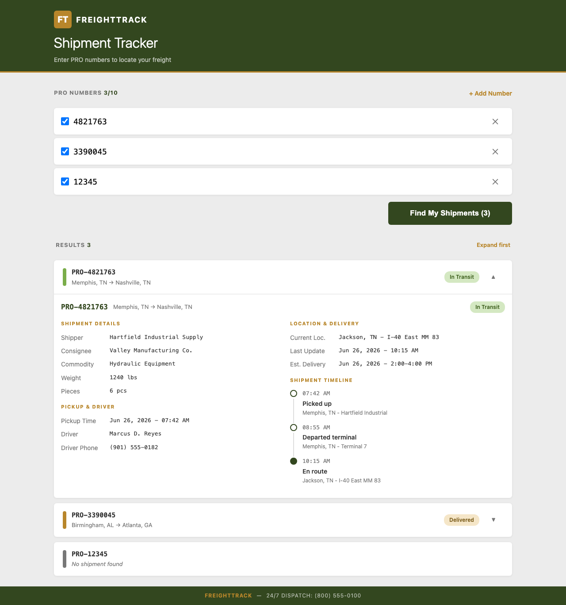
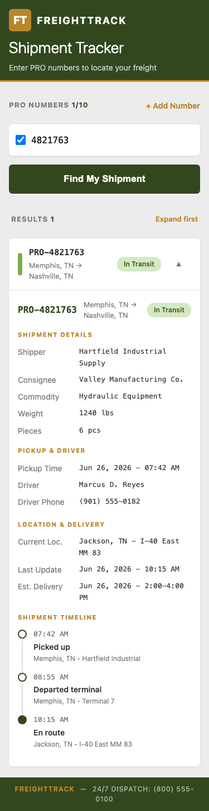

# FreightTrack User Guide

FreightTrack lets you track freight shipments by PRO number. Enter up to 10 PRO
numbers at once and see real-time status for each one.

## Getting Started

Open your browser and navigate to:

**http://localhost:8080/tracker.xhtml**

## Searching Shipments

### Single PRO Number

1. Type a PRO number in the input field (e.g. `4821763` or `PRO-4821763`).
2. The checkbox is automatically selected when you leave the field.
3. Click **Find My Shipment**.

### Multiple PRO Numbers

1. Click **+ Add Number** to add another row.
2. Enter the second PRO number (e.g. `3390045`).
3. You can toggle checkboxes to include or exclude specific PROs from the search.
4. Click **Find My Shipments (2)**.

### Three or More

Add up to 10 PRO numbers. Results display in an accordion — click a result to
expand it and see full tracking timeline.

## Mobile Support

FreightTrack works on mobile devices (375 px and above). The layout adapts
automatically to smaller screens.

## PRO Number Format

| Input | Accepted? | Normalized |
|-------|-----------|------------|
| `4821763` | Yes | `00004821763` |
| `PRO-4821763` | Yes | `00004821763` |
| `PRO 3390045` | Yes | `00003390045` |
| `abc123` | Yes (digits only) | `00000000123` |
| empty | No (ignored in search) | — |

- PRO numbers are 1–11 digits, stored zero-padded to 11 digits.
- Non-digit characters are stripped automatically.

## Result States

Each PRO lookup returns one of these states:

| State | Meaning |
|-------|---------|
| **In Transit** | Shipment is moving between locations |
| **Delivered** | Shipment has reached its destination |
| **Not Found** | No shipment matched that PRO number |
| **Error** | A lookup error occurred |

## Features

- **Independent lookups** — each PRO is looked up in parallel; results appear as they complete.
- **Session persistence** — your entries survive page refreshes and remain available across server instances.
- **Remove rows** — click the ✕ button on any row to remove it and its associated result.
- **Reset** — start fresh by removing all rows (minimum 1 row is always kept).

## Demo Data

The application ships with two seeded PRO numbers:

| PRO Number | Status |
|------------|--------|
| `4821763` | In Transit |
| `3390045` | Delivered |

Any other PRO number will return "Not Found."